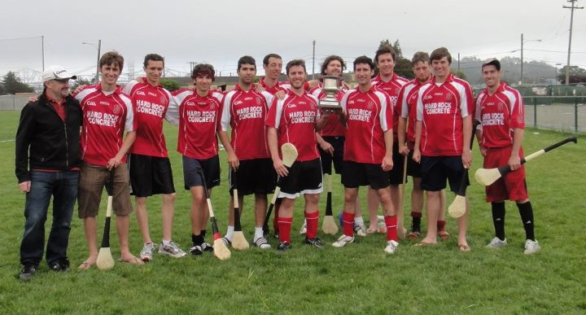

<!-- the below copy-pasted from old google sites site -->
The Stanford Hurling Club was officially founded as a student group at Stanford
in 2008, although it had its beginnings in 2006 when sophomore John Mulrow
initially tried to bring the sport to campus. 

<iframe width="560" height="315" src="https://www.youtube.com/embed/d-WIGqdqE94" title="YouTube video player" frameborder="0" allow="accelerometer; autoplay; clipboard-write; encrypted-media; gyroscope; picture-in-picture" allowfullscreen></iframe>

In 2009, Stanford won the first ever collegiate cup competition in North America 
by defeating Cal in a best of three series.

<iframe width="560" height="315" src="https://www.youtube.com/embed/ngT99oihLNo?start=4" title="YouTube video player" frameborder="0" allow="accelerometer; autoplay; clipboard-write; encrypted-media; gyroscope; picture-in-picture" allowfullscreen></iframe>

The start at Stanford seeded the growth of the collegiate GAA in North America,
but at Stanford club participation waned as the COVID-19 pandemic approached.
Stanford Hurling is not an active club right now, 
but we aim to return the club to full status and resume the
[winning streak](https://www.gaa.ie/hurling/news/gaa-world-news-stanford-university-win-five-row/).

{: width="300px"}
{: width="300px"}
{: width="300px"}

*Please email the address at the bottom if you've got more info about the
history and timing of the club, or pictures/video!*
