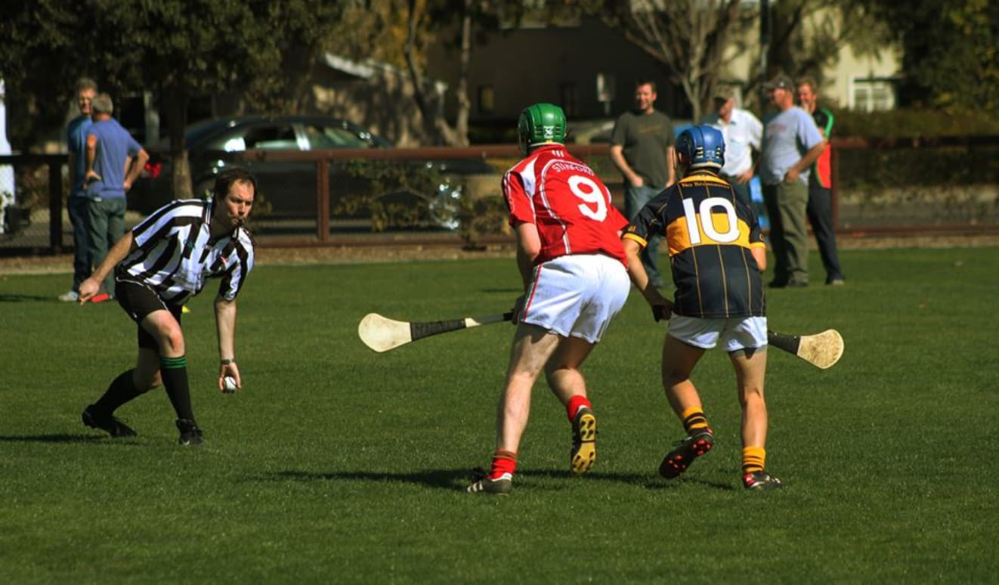
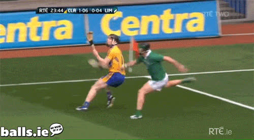
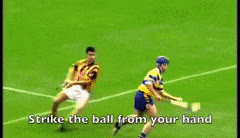
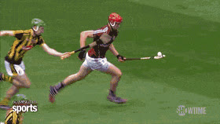
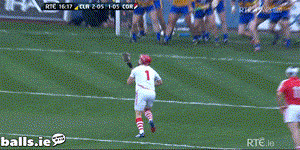

The purpose of this organization seeking to promote hurling at Stanford
is to promote the Irish sport of hurling among the Stanford University 
community. 
This is not a student club or officially affiliated or representing the
Stanford University.
Inter-collegiate competition between clubs is our eventual goal,
but we also want to promote comradery and just having fun!
So, whether it's to play competitively, 
to just hit it around and make some new friends,
or to learning more about Irish culture and the fastest game on grass, 
join us at our next event. 

Are you near Stanford and want to learn more?
Email us right now at 
<a class="u-email" href="mailto:hurling.stanford@gmail.com">hurling.stanford@gmail.com</a>
!

Check out [the schedule](calendar) for demonstrations, trainings, and games
at Stanford and the local area. 
For more information on hurling and rules for how to play,
[click here](hurling).
See the history of the Stanford Hurling Club [here](club-info).
See you on the pitch!

Here's some more examples of hurling **(mouse over or tap to play GIF)**:

&nbsp;

